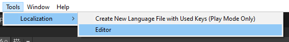
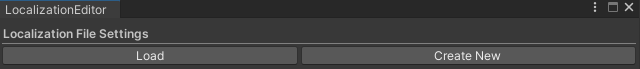
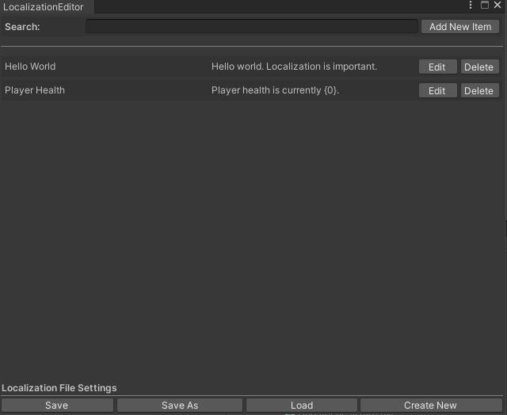

# Creating and Editing Language Files
Use `Localization Editor` custom window to create and edit language files. You can access `Localization Editor` from the Tools menu:

Once the editor is open, you can load language files or create a new language file. If you click on `Create New`, a new language file will be created and then you will be able to add key and value pairs to it. Remember that the language file should exactly match the language tags so for American English, the language file should be named `en-US`.

The rest is self-explanatory: 

- You can add a new key and value pair by clicking on `Add New Item`.
- You can edit an existing key and value pair by clicking on `Edit` next to that item.
- You can search keys and values in the search bar at the top of the window.
- You can use file methods like save, save as, load, or create new at the bottom of the window.

All language files are serialized (saved) in JSON format. 