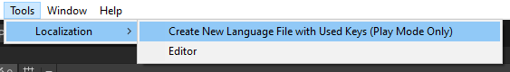

# Debugging Features

## Missing Keys
You never need to worry about any missing keys in a language file as `Localization Manager` logs these to a separate file in the `Missing Keys` folder you specified in `Localization Manager`. 

For instance, let's assume that your game was translated from American English to German. And the translator missed the `Warm Hello` key and did not translate it. When your game runs in German, some script will try to get the localized value for `Warm Hello` and will fail. In that case, two things will happen:

 1. The fact that `Warm Hello` was not found in the German language file will be logged in a file in the `Missing Keys` folder.
 2. `Localization Manager` will return the localized value for the fallback language, which is first the system language of the player and if that also fails, the main language you set in `Localization Manager`.

## Used Keys
You can create an empty language file with all the keys used in the game by going to Tools > Localization:

For instance, you might be working on a prototype where you do not want to invest any time in sorting out the translation just yet. In that case, you can just use any key you would like and when you run the game, you can create a language file with all the keys used.