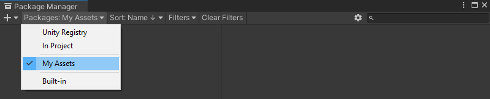

# Installation

After you purchase the asset from the Unity Asset Store, it will appear in the [package manager](https://docs.unity3d.com/2020.2/Documentation/Manual/upm-ui.html). You can access the package manager from *Window > Package Manager*. Once the window is open, make sure you are viewing *Packages: My Assets* as the Localization Asset will be listed there. Select Localization Asset and click the *Import* button located at the bottom right corner. 

Once the import is completed, you can access the Localization Editor from the Tools menu, add Localize UI Text component in the inspector, and use the Localization Manager in the scene.