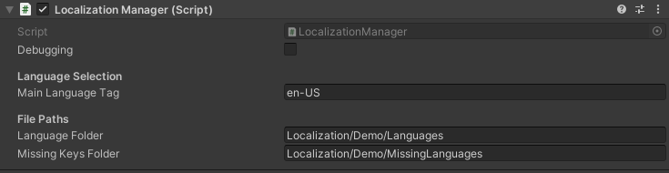

# Localization Manager

`Localization Manager` is the script that will handle all your localization-related tasks. This page explains how to configure `Localization Manager` as well as its variables and methods that might be relevant for you.

Note that `Localization Manager` implements the singleton pattern. This means 

- `Localization Manager` will always exist throughout your game and will not be destroyed when you load a new scene. 
- You can access `Localization Manager` from anywhere through its `Instance` variable without resorting to any `FindObjectOfType` or similar trick.

## Configuration
Create an empty gameobject in the scene and add `Localization Manager` as a component. Alternatively, you can drag and drop the Localization Manager prefab in the Prefabs folder.

Afterwards, you will see that `Localization Manager` has some fields you need to fill in. Below is a ready to use example.

### Debugging
This is for debugging purposes only. If checked, `Localization Manager` will log certain messages to the console to help you understand what exactly is happening in the scene.

### Language Selection
`Main Language Tag`  is where you set the main language of your game. What's important here is that **you should use the language tag here, not the name of the language**. This means if you want the main language to be American English, you will enter `en-US` not `English` or `American English`. 

Language tags allow `Localization Manager` to sort out even the small differences between use of a language in different regions (such as English in Britain and USA). The most common language tags can be found below but for a full list of the language tags, see [this website](http://docwiki.embarcadero.com/RADStudio/Sydney/en/Language_Culture_Names,_Codes,_and_ISO_Values). 

|Language|Language Tag  |
|--|--|
|English - United Kingdom|en-GB|
|English - United States|en-US|
|French - France|fr-FR|
|German - Germany|de-DE|
|Spanish - Spain|es-ES|

Note that your language file should exactly match this tag so for American English, the language file should be named `en-US`.

### File Paths
File paths are where in your directory you will store your language files and missing keys logs. All paths are relative to your assets folder. So you only need to write `Languages` if your language files are located at `/Assets/Languages`. **Never start a path with** `/` because then the path will not be relative.

There are two file paths:

 - `Language Folder` is where all your language files should be located.
 - `Missing Keys Folder`  is where `Localization Manager` will keep the logs of the keys that were not translated in the given language file.

## Readiness
Whether Localization Manager is ready and the language files are properly loaded can be checked by accessing `IsReady` property and checking if it is `true`. This can simply be done like this in any of your scripts:
> if(LocalizationManager.Instance.IsReady == true)  
> {  
> // Your code here  
> }

## Methods
There are several methods you might want to make use of.

### GetAvailableLanguages()
This method does not take any parameter and will return a `Dictionary<string, string>`  containing the native names of the available languages and their language tags. For instance, if you have `en-US` and `de-DE` in your `Language Folder`, this method will return the following key and value pairs:

|Key|Value  |
|--|--|
|English|en-US|
|Deutsch|de-DE|

### ChooseLanguage(string languageTag)
If you would like to change the language and set a new language at runtime, you can use the `ChooseLanguage` method. It has only one string parameter, which is the `languageTag`. This is the same with the language tag we mentioned in the configuration of `Localization Manager`. So if you would like to change the language to German, you can use the following code:

> LocalizationManager.Instance.ChooseLanguage("de-DE");

Once the `ChooseLangauge` method is called, `Localization Manager` will automatically save the chosen language in the `PlayerPrefs` file and remember it the next time.

### AddLocalizeUIText(GameObject gameObject, string key, params object[] variables)
If you would like to add a `LocalizeUIText` component to a gameobject on runtime, you will need to use this method. You simply need to specify the relevant gameobject, key for the localization, and the variables (if any).

Note that this is a static method so you do not need to access the `Instance` first. You can just use the following code:
> LocalizationManager.AddLocalizeUIText(menuStartButtonGameObject, "Start Button");

### GetLocalizedValue(string key, params object[] variables)
You can use this method if you would like to retrieve the localized value of a key manually. You can provide the variables in the method as well.