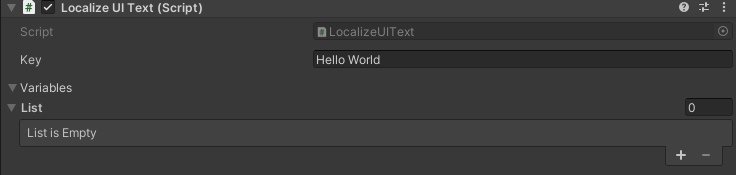
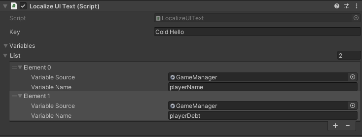

# Using Localize UI Text Component

`LocalizeUIText` is a ready to use component that can localize any `Text` or `Text Mesh Pro` text with the given key. All you need to do is to add `LocalizeUIText` to the gameobject with the `Text` or `Text Mesh Pro` component and enter the key and variables (if any).

## Static Localized Text
'Static' here means there is no variable in the localized text, meaning there is no external data that needs to be taken into account when retrieving this localized text. For instance, *"Hi friend, how are you?"* is a static localized text.

For static localized text, you only need to enter the key and nothing else. You can leave the variables list empty.

## Dynamic Localized Text
'Dynamic' means there will be variables in the localized text so we will need external data to create the final localized text. For instance, *"Hi `Joseph`, how are you doing?"* can be a dynamic localized text if `Joseph` will need to change based on the name the player given itself. If the player named itself `George`, the localized text will need to be *"Hi `George`, how are you doing?"*. This is done by using a special markdown in the localized value and giving the relevant data in the `LocalizeUIText` component.

In our example, the localized text will be *"Hi {0}, how are you doing?"* `{0}` is a placeholder here and will be replaced with the data we provide by `Localization Manager`. The localized value can have more than one variables like *"Hi {0}, you owe me {1} gold."* Here, we will need to provide the name of the player as well as the amount it owes as variables in the exact same order because the first variable will replace `{0}` and the second will replace `{1}`.

For each variable, you need to provide a source and its exact name in that source:

- **Source**: The source can be a script that implements the singleton pattern (with an `Instance` variable), a scriptable object, or a gameobject component.
- **Name**: Name of the property or the field should be written exactly as it is in the source.

See the below example:

### Updating Dynamic Localized Values
Some variables you use in localized values might need to be updated such as player health. If you have a localized value like *"Player health is {0}"*, it will not be enough that this is retrieved once but it will need to be updated in intervals of your choice. For this purpose, you can simply call the `UpdateText()` method of the relevant `LocalizeUIText` component.

If you are updating a `LocalizeUIText` component that you *created in the inspector*, you do not need to give any parameters to the UpdateText() method as it will remember the variables you provided in the inspector:
> [Serializefield] LocalizeUIText playerHealthUI; 
> ... 
> playerHealthUI.UpdateText();

However, if you are updating a `LocalizeUIText` component that was *created on runtime* with `LocalizationManager.AddLocalizeUIText(...)`, then you will need to provide the relevant variables in the UpdateText() method:

> [Serializefield] LocalizeUIText playerHealthUI; 
> public int playerHealth; 
> ... 
> playerHealthUI.UpdateText(playerHealth);
